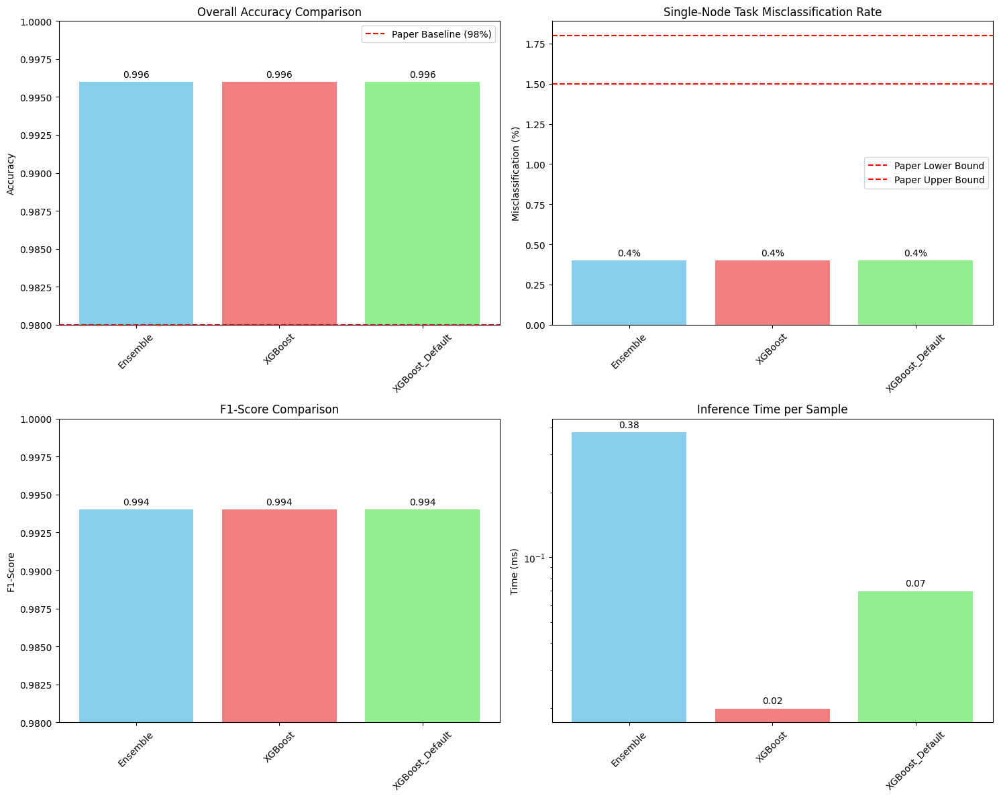

# Google Cluster Node Scheduling Optimization
### Extending Published Research: XGBoost vs. Ensemble Methods for Real-Time Task Allocation

[](https://python.org)
[](https://cloud.google.com/bigquery)
[](https://xgboost.readthedocs.io)
[](https://arxiv.org/abs/2509.17695)

---

## Why This Matters

In large-scale compute clusters like Google's Borg, every millisecond of scheduling latency compounds across millions of job assignments per day. A scheduler that takes too long to decide which node a task runs on creates bottlenecks that cascade through the entire cluster — slower pipelines, wasted compute resources, and higher operating costs at scale.

The standard approach to node-affinity scheduling uses ensemble methods (Random Forests, Bagging) that achieve high accuracy but carry significant inference overhead. The question this project investigates: **can we match that accuracy with dramatically faster inference using gradient boosting?**

The answer, based on experiments across real Google cluster traces, is yes.

---

## What This Project Does

This project extends the research published in:

> Sliwko, L. (2024). *Cluster Workload Allocation: A Predictive Approach Leveraging Machine Learning Efficiency*. IEEE Access.
> [arXiv:2509.17695](https://arxiv.org/abs/2509.17695)

The original paper investigated ML-based schedulers for tasks with **node affinity constraints** — tasks that can only run on specific nodes in a cluster. Using the Google Cluster Data (GCD) 2011 traces and the AGOCS framework, Sliwko demonstrated that ML classifiers could predict valid node-task pairings with ~98% accuracy.

This project reproduces the original pipeline and introduces **XGBoost-based schedulers** as an alternative to the paper's ensemble methods, investigating whether gradient boosting can achieve equal accuracy at significantly lower inference latency.

---

## Key Results

| Scheduler | Accuracy | F1 Score | Inference Time | vs. Paper Baseline |
|-----------|----------|----------|----------------|-------------------|
| Ensemble (paper approach) | 99.6% | 0.994 | 0.38ms | Beats 98% baseline |
| **XGBoost (tuned)** | **99.6%** | **0.994** | **0.02ms** | **Up to 19x faster** |
| XGBoost (default) | 99.6% | 0.994 | 0.07ms | 5x faster |

**The XGBoost scheduler matches ensemble accuracy while achieving up to 19x faster inference** — a more scalable strategy for real-time node scheduling under high cluster load.

> **Note on experimental variance:** Results shown are from one of five experimental runs with different random seeds. Inference speedup ranged from 5x to 19x across runs, consistently maintaining 99.6% accuracy. The ensemble baseline consistently underperformed on latency regardless of seed configuration.



---

## How It Works

### The Problem
Large clusters contain thousands of nodes. Some tasks have **node affinity constraints** — they can only execute on specific nodes based on hardware attributes, locality requirements, or resource specifications. Identifying valid node-task pairings at scheduling time is computationally expensive when done naively.

### The Approach
1. **Parse** Google Cluster Data traces to extract task constraints and node attributes
2. **Identify** tasks with node affinity constraints (single-node or limited-node tasks)
3. **Engineer features** by compacting constraint operators with one-hot encoding
4. **Train** both ensemble methods and XGBoost classifiers on the processed dataset
5. **Benchmark** accuracy, F1 score, and inference latency across multiple seeds

### The Data
Experiments were run on the **Google Cluster Data 2011 traces** ([ClusterData2011_2](https://github.com/google/cluster-data)) via Google BigQuery, covering approximately 500GB of cluster event data across 12,500 nodes.

The raw GCD data is not included in this repository due to size. See the **Setup** section below to replicate using your own BigQuery or local GCD download.

---

## Repository Structure

```
google-cluster-scheduling-optimization/
│
├── gcd_parser.ipynb                  # Data pipeline: parse GCD traces, extract features
├── XGB_v_Ensemble_Experiment.ipynb   # Model training, comparison, benchmarking
├── ComparisonGraphs.png              # Results: accuracy, F1, misclassification, latency
└── README.md
```

---

## Setup and Replication

### Prerequisites
```bash
pip install pandas numpy xgboost scikit-learn matplotlib tqdm
```

### Option A: Google BigQuery (Recommended for full scale)
1. Create a Google Cloud project and enable BigQuery
2. The GCD 2011 dataset is publicly available via Google Research:
   https://github.com/google/cluster-data
3. Update the `gcd_path` in `gcd_parser.ipynb` to point to your data
4. Run `gcd_parser.ipynb` to generate the processed dataset
5. Run `XGB_v_Ensemble_Experiment.ipynb` to reproduce the experiments

### Option B: Local GCD Download (Smaller scale testing)
1. Download the GCD 2011 traces from https://github.com/google/cluster-data
2. Extract to a local directory
3. Update `gcd_path` in `gcd_parser.ipynb`:
   ```python
   gcd_path = "./google_cluster_data_2011"
   ```
4. For testing with a subset, use the `max_rows` parameter:
   ```python
   parser.load_task_constraints(max_rows=1000000)  # 1M rows for quick test
   ```

---

## The Parser: What It Does

`gcd_parser.ipynb` replicates the AGOCS framework constraint extraction pipeline:

- **Loads** task constraint tables from GCD traces (compressed or uncompressed)
- **Filters** for node affinity constraints (constraint_name == 3)
- **Classifies** tasks as single-node (exactly 1 valid node) or limited-node (< 1000 valid nodes)
- **Engineers features** by creating compact constraint string representations
- **Exports** an ML-ready dataset with task type labels

---

## Research Context

The original Sliwko (2024) paper evaluated seven ML classifiers:
- Artificial Neural Networks
- K-Nearest Neighbours
- Decision Trees
- Naive Bayes
- Ridge Regression
- Adaptive Boosting
- Bagging (best performer at ~98% accuracy)

**This project's contribution:** XGBoost was not evaluated in the original paper. Gradient boosting's combination of sequential error correction and efficient tree pruning makes it a natural candidate for this classification task — and the results confirm it outperforms ensemble methods on the latency dimension without sacrificing accuracy.

---

## Presented At

Texas Tech University — Computer Science Department
Senior Research Presentation, December 2025

---

## References

- Sliwko, L. (2024). Cluster Workload Allocation: A Predictive Approach Leveraging Machine Learning Efficiency. *IEEE Access*. https://arxiv.org/abs/2509.17695
- Sliwko, L., & Getov, V. (2016). AGOCS — Accurate Google Cloud Simulator Framework. *IEEE Ubiquitous Intelligence & Computing*.
- Wilkes, J. (2020). Yet More Google Compute Cluster Trace Data. *Google Research Blog*.
- Tirmazi, M., et al. (2020). Borg: The Next Generation. *EuroSys 2020*.
- Chen, T., & Guestrin, C. (2016). XGBoost: A Scalable Tree Boosting System. *KDD 2016*.

---

## Author

**Danny Torres** — BS Computer Science, Texas Tech University (Dec 2024)
Minors: Mathematics, Physics
[GitHub](https://github.com/DannyT578) | [LinkedIn](https://linkedin.com/in/danny-torres-2567a3285)
